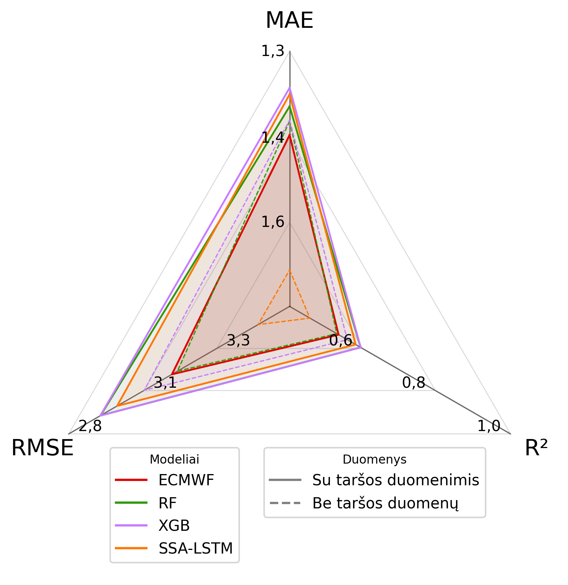
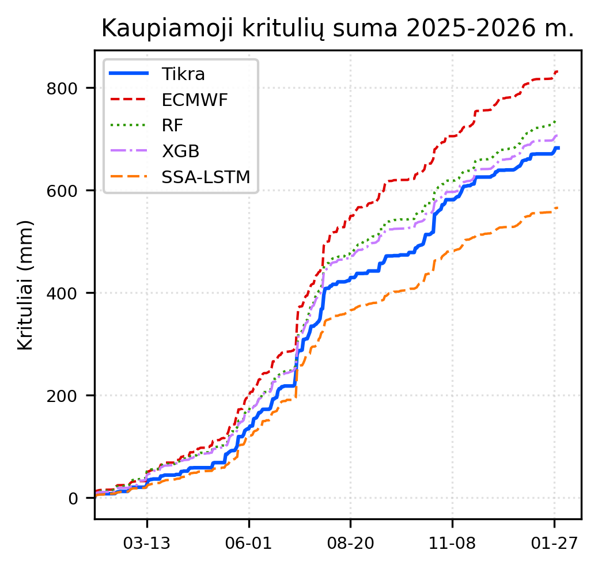

# Duomenų mokslo projektas

  

## Summary

Review of the literature has revealed that the concentration of particulate matter in the atmosphere influences meteorological conditions and, consequently, errors in model predictions. Aerosol particles act as condensation nuclei, contributing to the formation of cloud and ice particles. However, the main weather forecast model for European countries, the ECMWF, does not account for chemical changes in the atmosphere and can only provide a resolution of $9$ km, which is half that of local national models. Therefore, in this study, to improve the accuracy of the global model’s weather forecasts for the city of Vilnius, it combines data from a local automatic weather station and atmospheric pollution data obtained from the Sentinel--5P and MetOp--B and the Copernicus Atmosphere Monitoring Service (CAMS) European Regional Air Quality Reanalysis Ensemble. To achieve this goal, machine learning models are used, such as random forests (RF), extreme gradient boosting (XGB) algorithms, and a more complex method—singular spectrum analysis integrated with a long short-term memory (SSA-LSTM). An ensemble of these models is also tested, which is trained using the forecasts from the mentioned models, with the final forecast provided by the Extreme Gradient Boosting algorithm. 

**Keywords:** Pollution analysis, machine learning, Random Forest, Extreme Gradient Boosting, Singular Spectrum Analysis, Long Short-Term Memory, precipitation forecast, time series

## Key Results

The study empirically demonstrates that incorporating atmospheric pollution data significantly improves precipitation forecast accuracy compared to the global ECMWF baseline.

### Model Performance Comparison (365-Day Dataset)

The table below compares the predictive accuracy of various models before and after integrating atmospheric pollution features.

| Model | Scenario | $R^2$ | MAE (mm) | RMSE (mm) | $r_s$ |
| :--- | :--- | :---: | :---: | :---: | :---: |
| **ECMWF** | **Baseline** | 0.4846 | 1.4452 | 3.1535 | **0.7647** |
| Random Forest (RF) | Without Pollution | 0.4792 | 1.4195 | 3.1700 | 0.7212 |
| | **With Pollution** | 0.5520 | 1.3928 | 2.9401 | 0.7325 |
| XGBoost (XGB) | Without Pollution | 0.5114 | 1.4178 | 3.0705 | 0.7303 |
| | **With Pollution** | **0.5523** | **1.3588** | **2.9392** | 0.7228 |
| SSA-LSTM | Without Pollution | 0.3970 | 1.6922 | 3.4112 | 0.6032 |
| | **With Pollution** | 0.5368 | 1.3708 | 2.9895 | 0.6640 |

*Performance highlights: The inclusion of pollution data led to a notable increase in $R^2$ and a reduction in both MAE and RMSE across all machine learning models. The XGBoost model with pollution data achieved the highest overall predictive accuracy.*

---

### Ensemble Performance (Small Sample - 108 days)
| Model | MAE (mm) | RMSE (mm) |
| :--- | :---: | :---: |
| ECMWF (Baseline) | 1.14 | 2.45 |
| **ML Ensemble (Final)** | **1.09** | **2.32** |

## Visual Analysis

  
   
  <i>Figure 1: Radar chart comparison of model performance metrics. A larger triangular area signifies superior model performance.</i>

The radar chart in **Figure 1** illustrates the comparative performance of the models across multiple metrics. When atmospheric pollution data is included, the Random Forest (RF), XGBoost (XGB), and SSA-LSTM models all demonstrated clear improvements over the global ECMWF baseline. However, despite these gains, the SSA-LSTM model's RMSE remains higher than that of both the RF and XGB models.

The analysis further highlights the critical role of pollution data:
*   **Without Pollution Data:** Model performance degrades significantly and exhibits higher variance. In this scenario, the XGBoost model still maintains an edge over the ECMWF baseline, while the Random Forest model performs similarly to the global model. 
*   **Hybrid SSA-LSTM:** The radar plots clearly identify the hybrid SSA-LSTM as the least effective model when atmospheric pollution information is excluded.
*   **Overall Findings:** While the machine learning approaches successfully reduced MAE and RMSE, $R^2$ values remain relatively low across both the ML algorithms and the ECMWF baseline, suggesting inherent complexities in precipitation forecasting.

  
   
  <i>Figure 2: Cumulative precipitation comparison between observations, global baseline (ECMWF), and optimized ML models.</i>

The cumulative precipitation curves in **Figure 2** facilitate the identification of systematic prediction biases:
*   **Global Baseline (ECMWF):** Exhibits a significant positive bias, systematically overestimating precipitation with a Mean Bias Error (MBE) of 0.408 mm.
*   **Random Forest (RF) & XGBoost (XGB):** These models align closely with the observed precipitation trajectory, significantly reducing bias to 0.153 mm and 0.066 mm, respectively.
*   **SSA-LSTM:** Conversely, the hybrid SSA-LSTM model exhibits a negative bias, underestimating cumulative precipitation with an MBE of -0.32 mm.

The integration of pollution features notably allows the RF and XGB models to track the actual observed precipitation trends with high precision, overcoming the systematic overestimation inherent in the standard global meteorological model.

## Used Packages

### Python
                  

### R
          

---

## Folder Summaries

### Python Project (`code/python/`)

#### **Code Modules**
- **`ACSAF/`**: Scripts and notebooks for MetOp-B GOME-2 data retrieval and preprocessing, including MPI-based parallel processing in `MPI/`.
- **`CAMS/`**: Specialized Python scripts for downloading and preparing atmospheric data from the Copernicus Atmosphere Monitoring Service (CAMS) for various pollutants (NH3, CH4, PM10, PM2.5, etc.).
- **`datasets_prep/`**: Core data engineering notebooks for merging, cleaning, and imputing air quality, local meteorological (METEO LT), global meteorological (ECMWF), and Sentinel-5P datasets.
- **`ecmwf/`**: Tools for automated retrieval of yearly and monthly meteorological data using the ECMWF API.
- **`EUMDAC/`**: Scripts for testing and interacting with EUMETSAT Data Access Client (EUMDAC) for satellite data tailoring and downloads.
- **`meteo/`**: Tools for interacting with the Lithuanian Hydrometeorological Service (METEO.LT) API and specialized preprocessing for local weather station data.
- **`Models/`**: Implementation of machine learning models including Random Forest, XGBoost, SSA-LSTM, and Lasso feature selection. Contains notebooks for model training, ensemble creation, and error analysis.
- **`sentinel/`**: Automated preprocessing and location-specific (Lithuania, Ryga) retrieval scripts for Sentinel-5P data products.
- **`visuals/`**: Notebooks for generating spatial heatmaps and time-series visualizations for satellite datasets.

#### **Data & Logs**
- **Satellite Data**: HDF5 structures (`hdf5_structure.txt`), large MetOp-B CSV datasets (`METOPB_full_set.csv`), and Sentinel-5P CSVs for various regions.
- **Meteorological Data**: Local weather station records from METEO LT (`Vilnius_meteo_data_final_2018_2026.csv`) and global ECMWF reanalysis data.
- **Processed Datasets**: Final project datasets (`dm_project_dataset.csv`) and prediction outputs (`All_predictions.csv`, `RF_prediction.csv`, `xgboost_pred.csv`).
- **Models & Logs**: Serialized PyTorch models (`params.pt`, `optimizer.pt`), training history (`history.json`), and detailed HPC/MPI execution logs (`.log`).

### R Project (`code/R/`)

#### **Code Modules**
- **`EDA/`**: Comprehensive Exploratory Data Analysis notebooks and RMarkdown files focusing on dependency analysis, outlier detection, and seasonality/tendency studies.

---

## Authors

[@Cristup](https://github.com/Cristup) [@EvelinaDu](https://github.com/EvelinaDu) [@rugcer04](https://github.com/rugcer04)

---

With Gemini CLI c0.34.0 (Model: Gemini 3, 2026-03-19 version), Wednesday, May 27, 2026.